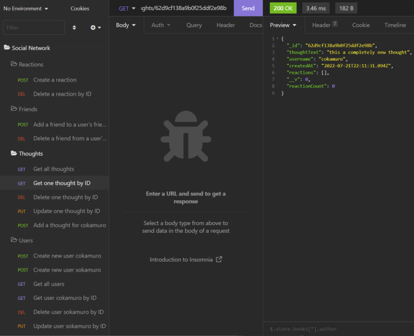

# 18 NoSQL Challenge: Social Network API

[Video of program walkthrough - part 1 - MongoDB/Mongoose verification, User API calls verified in Insomnia](https://drive.google.com/file/d/1sY9z2ZEvaJJJoT1UVQVstI_MaR8WmyIW/view)

[Video of program walkthrough - part 2 - Thought API calls verified in Insomnia](https://drive.google.com/file/d/1OJ7VoFTEm20eXhP5c7Zu4VTE3dJAjy8M/view)

[Video of program walkthrough - part 3 - Reaction and Friend API calls verified in Insomnia](https://drive.google.com/file/d/1WmmWtsmAcj4qGLPyKp7EaGsXGOFKVX7g/view)

[Video of program walkthrough - part 4 - BONUS - Cascading delete of thoughts on user delete](https://drive.google.com/file/d/1CZrX0XEAYm31ycl0WzJcZGyH8ZnX2AVI/view)

## Table of Contents
- [Description](#description)
- [Visuals](#visuals)
- [Usage](#usage)

## Description
This is the solution JavaScript for the 02-Challenge assignment in the 18 NoSQL Module.

The purpose of the assignment was to create an API for managing the basic operation of a social networking site.  This project implements User, Thought, and Reaction models.  These models are created with the Mongoose ODM, on a MongoDB database.  I have included to the appropriate route code for the API routes to support CRUD operations through the service (against the ODM).  This is an *Express.js* service.

This project achieves all of the stated project requirements, and meets the *bonus criteria of deleting thoughts belonging to a user when the user is deleted.

## Usage 
This program has has dependencies, and requires their installation via *npm*.  This service can be invoked via Node at the command prompt using *npm start*, or with *nodemon*.

## Installation Instructions
The program requires *npm* installation of the express, dotenv, moment, and mongoose modules (and their dependencies).  MongoDB needs to be installed on the machine

## Visuals
### The program in operation
[Video of program walkthrough - part 1 - MongoDB/Mongoose verification, User API calls verified in Insomnia](https://drive.google.com/file/d/1sY9z2ZEvaJJJoT1UVQVstI_MaR8WmyIW/view)

[Video of program walkthrough - part 2 - Thought API calls verified in Insomnia](https://drive.google.com/file/d/1OJ7VoFTEm20eXhP5c7Zu4VTE3dJAjy8M/view)

[Video of program walkthrough - part 3 - Reaction and Friend API calls verified in Insomnia](https://drive.google.com/file/d/1WmmWtsmAcj4qGLPyKp7EaGsXGOFKVX7g/view)

